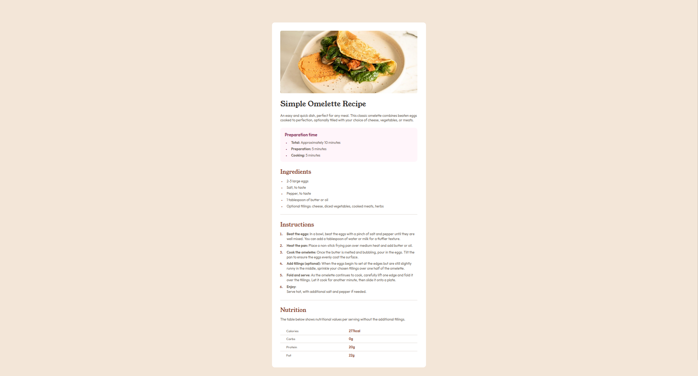

# Frontend Mentor - Recipe page solution

This is a solution to the [Recipe page challenge on Frontend Mentor](https://www.frontendmentor.io/challenges/recipe-page-KiTsR8QQKm). Frontend Mentor challenges help you improve your coding skills by building realistic projects.

## Table of contents

- [Overview](#overview)
  - [The challenge](#the-challenge)
  - [Screenshot](#screenshot)
  - [Links](#links)
- [My process](#my-process)
  - [Built with](#built-with)
  - [What I learned](#what-i-learned)
  - [Continued development](#continued-development)
  - [Useful resources](#useful-resources)
- [Author](#author)

## Overview

### Screenshot

### Links

- Solution URL: [My solution](https://your-solution-url.com)
- Live Site URL: [Live Site](https://matiasbastarrica.github.io/reicpe-page-main/)

## My process

### Built with

- Semantic HTML5 markup
- CSS custom properties
- Mobile-first workflow
- HTML table
- Negative margins
- :not() pseudo-class
- calc() function

### What I learned

In this challenge I decided to take a mobile-first approach.
I learned how to style the border of specific table rows.
I wrote and styled an HTML table which is an element that I wasn't really used to work with.

The  of the recipe gave me the oportunity to think outside the box in order to achieve different layouts for the same element based on different viewport sizes.
The  in smaller viewports take the full width of the recipe container while in bigger viewports it respects the padding of the recipe container.
In order to do this I also took a mobile-first approach. First I applied the following rule to the recipe container (the <article class="recipe">):

- padding: 0 1.625rem 2.5rem;
  Then using the image selector I set these rules:
- width: calc(100% + (1.625rem \* 2));
- margin-left: -1.625rem;
  To make the  take the full width of its container in bigger viewports I use a media query and set the following rules:
- .recipe {
  padding: 2.8rem;
  }
- .recipe-img {
  width: 100%;
  margin-left: 0;
  }

### Continued development

For future challenges I would like to continue using a mobile-first workflow alongside media queries. I think I need to gain more confidence on these areas.

### Useful resources

- [CSS border-collapse Property](https://www.w3schools.com/cssref/pr_border-collapse.php) - This helped me understand a property that came in handy to style the table row of the recipe page.
- [How to Add Border to <tr> Element in CSS ?](https://www.geeksforgeeks.org/how-to-add-border-to-tr-element-in-css/) - This is an amazing article which helped me finally understand how to set a border to a table row. I'd recommend it to anyone still learning this concept.
- [CSS :not() Pseudo-class](https://www.w3schools.com/cssref/sel_not.php) - This helped me understand this particular pseudo-class.
- [Everything You Need to Know About the Gap After the List Marker](https://css-tricks.com/everything-you-need-to-know-about-the-gap-after-the-list-marker/) - This article provided me a useful insight on how to set the spacing of a list item.
- [CSS ::marker Pseudo-element](https://www.w3schools.com/cssref/sel_marker.php#gsc.tab=0) - This helped me learn how to style the marker of list items.
- [HTML Table Sizes](https://www.w3schools.com/html/html_table_sizes.asp) - This helped me understand how to adjust the width of the table cells.

## Author

- Frontend Mentor - [@MatiasBastarrica](https://www.frontendmentor.io/profile/MatiasBastarrica)
